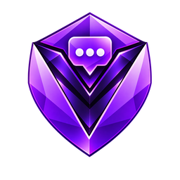
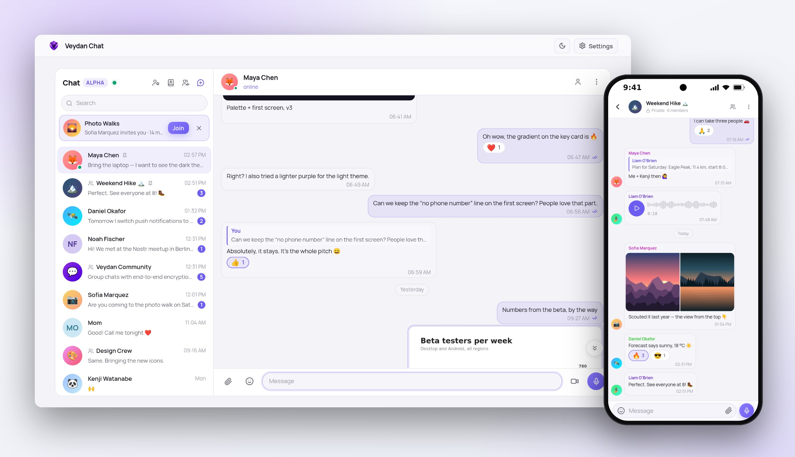
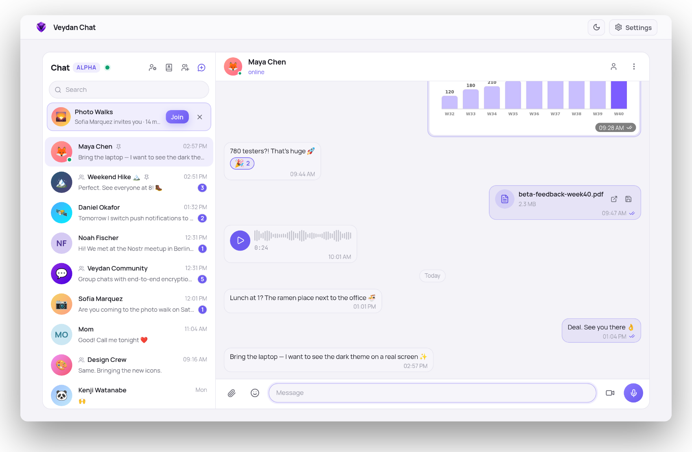
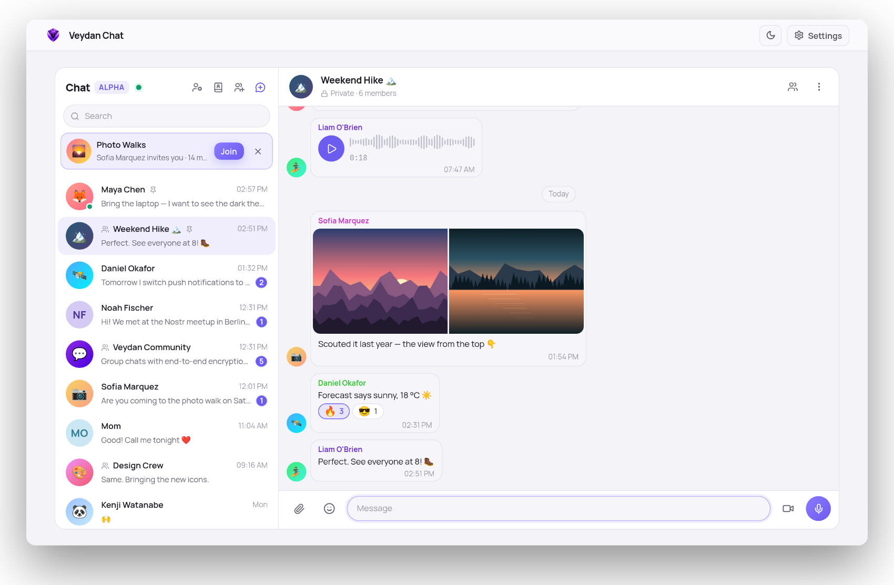
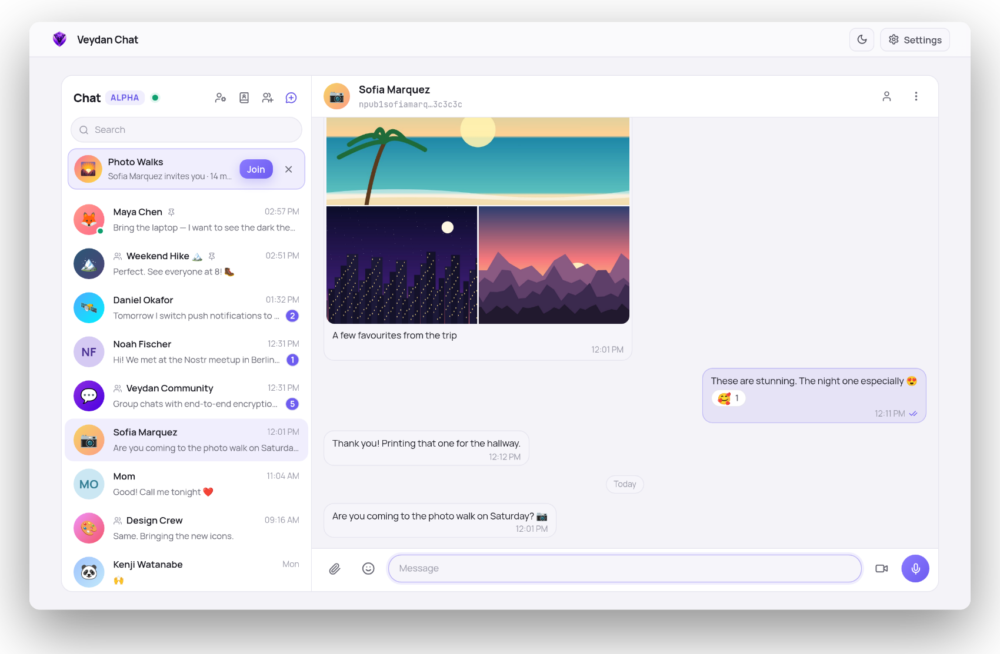
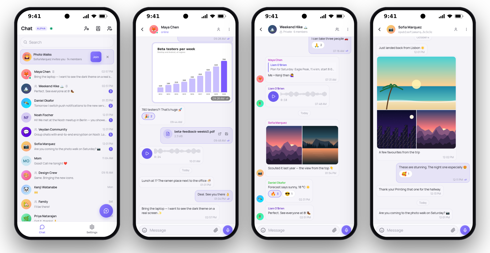

  

<h1 align="center">Veydan Chat</h1>

  <b>End-to-end encrypted chat on Nostr.</b> 
  No phone number, no central server: your identity is a key that only you hold.

  
  
  
  

  15 languages: English · Deutsch · Español · Français · Italiano · Polski · Русский · Українська · Português (Brasil) · Türkçe · Bahasa Indonesia · Tiếng Việt · 简体中文 · 日本語 · 한국어

  <a href="https://github.com/veydanproject/Veydan-Chat/releases/latest"><b>Download</b></a> ·
  <a href="#features">Features</a> ·
  <a href="#on-your-phone">On your phone</a> ·
  <a href="#privacy-and-encryption">Privacy</a> ·
  <a href="docs/DEVELOPMENT.md">Build from source</a>

<picture>
  <source media="(prefers-color-scheme: dark)" srcset="docs/images/hero-dark.jpg">
  
</picture>

## Why Veydan Chat

- **No phone number, no sign-up.** Your account is a cryptographic key made
  on your device. Nobody issues it, and nobody can take it away.
- **Encrypted end to end.** Messages, photos and voice notes are encrypted on
  your device. The servers that carry them cannot read them.
- **No single company in the middle.** Chat runs on Nostr, an open network of
  relays. Use the Veydan servers, or only your own.
- **Everything you expect from a messenger** — groups, photos, voice and
  video messages, reactions, replies, read receipts — on your computer and
  your phone.

## Features

### Conversations

- **Replies, edits and reactions** — up to three emoji per message, with a
  full emoji picker.
- **Delivered and read** marks, **online** and **last seen** — each can be
  switched off, and then you stop seeing them for others too.
- **Message requests** — the first message from someone new arrives as a
  request: accept, decline or block.
- **A private address book** on your device: add people by their key, a
  `name@domain` address or a contact link, with your own nickname and note.

<picture>
  <source media="(prefers-color-scheme: dark)" srcset="docs/images/screen-dm-dark.png">
  
</picture>

### Groups

- **Public groups** — anyone with the link or QR code can join and read the
  history.
- **Private groups** — by invitation, or by request that an admin approves;
  you decide whether new members see earlier messages.
- **Roles** — owner, admins, moderators; mute, remove or ban members, hand the
  group over, or disband it.
- A **new group key** every time someone is removed, so they cannot read what
  comes next.

<picture>
  <source media="(prefers-color-scheme: dark)" srcset="docs/images/screen-group-dark.png">
  
</picture>

### Photos, files, voice and video

Send **photos and albums**, **videos** and **files** of any kind, record
**voice messages** and round **video messages** (hold to record, slide left
to cancel). Large transfers can be paused and resumed. Every chat has its
shared photos, links and voice messages in tabs.

<picture>
  <source media="(prefers-color-scheme: dark)" srcset="docs/images/screen-album-dark.png">
  
</picture>

### Notifications

On a computer — system notifications when the window is in the background.
On Android — push notifications even when the app is closed, with a choice
of what they show: the sender and the text, only the sender, or nothing.

### Works where networks are restricted

If the Veydan servers are blocked where you are, Chat can reach them through
a **bridge** — automatically or always. A bridge sees that you connect and
how much, but cannot read your messages or files. **Silent mode** disconnects
from every server at once.

## On your phone

The Android app has everything the desktop app has, plus push notifications.

<picture>
  <source media="(prefers-color-scheme: dark)" srcset="docs/images/phones-dark.png">
  
</picture>

## Getting started

1. **Create your key** — or import one you already have (`nsec`, or an
   encrypted `ncryptsec` backup).
2. **Save the encrypted backup** the app shows you. There is no server and no
   password reset: the backup is the only way to restore your account on a
   new device.
3. **Choose the servers** — the Veydan servers, or only your own relays.
4. **Share your contact link** or QR code, and start talking.

## Download

Get the latest version from the
**[releases page](https://github.com/veydanproject/Veydan-Chat/releases/latest)**.

| Platform | What to download |
|---|---|
| **Windows** 10 and 11 (x64) | the `.exe` installer (or the `.msi`) |
| **macOS** — Apple Silicon | the `.dmg` marked `aarch64` |
| **macOS** — Intel | the `.dmg` marked `x64` |
| **Linux** (x64) | `.AppImage`, or `.deb` / `.rpm` for your distribution |
| **Android** 8.0 and newer (64-bit ARM) | the `.apk` |

If macOS refuses to open the app on the first launch, right-click it and
choose **Open**. Push notifications on Android need Google Play services.

The app updates itself when a new version comes out. Installed from a
`.deb` or `.rpm`? The app tells you about the new version, and you install it
from the releases page.

Veydan Chat is in **alpha**: expect it to keep changing from release to
release.

## Privacy and encryption

- **Direct messages** are encrypted and sealed on your device using the Nostr
  standards NIP-44 and NIP-17/NIP-59 ("gift wrap"): a relay stores an
  encrypted envelope addressed to the recipient — it sees neither the text
  nor who sent it.
- **Group messages** are encrypted with the group's key (AES-256-GCM). A
  private group gets a fresh random key whenever a member is removed.
- **Photos, files and voice** are encrypted on your device and stored as
  anonymous blocks.
- **Your key** stays on your device, inside the app's encrypted vault behind
  the app lock. Back it up as an encrypted `ncryptsec`.
- **Your own servers.** Choose "My own servers" and the app sends nothing to
  Veydan servers: only your relays, your media storage (S3 or Blossom) and,
  if you want push, your push server.
- **Push notifications** (Android, optional): the push server learns which
  relays and groups to watch for you, and the push passes through Google;
  neither can read your messages — they only see that a message arrived, and
  when.
- **No telemetry.**

## The Veydan family

| | App | What it is |
|---|---|---|
|  | **Veydan Chat** | End-to-end encrypted chat on Nostr |
|  | [Veydan Notes](https://github.com/veydanproject/Veydan-Notes) | Markdown notes with end-to-end encrypted sync |
|  | [Veydan Pass](https://github.com/veydanproject/Veydan-Pass) | Passwords and one-time codes, encrypted and synced |
|  | [Veydan Space](https://github.com/veydanproject/Veydan-Space) | All of them in one workspace, plus browser profiles, proxies and SSH |

## Feedback

Found a bug or have an idea? [Open an issue](https://github.com/veydanproject/Veydan-Chat/issues).
Developers: see [docs/DEVELOPMENT.md](docs/DEVELOPMENT.md) for building from
source.

## License

Copyright © 2026 **Veydan Project**.

Developed by **Rookbeam Technologies LLC**, USA.

Veydan Chat is **source-available** software under the
[PolyForm Perimeter License 1.0.1](https://polyformproject.org/licenses/perimeter/1.0.1):
see [`LICENSE`](LICENSE), a summary in [`LICENSE-SUMMARY.md`](LICENSE-SUMMARY.md)
and the licences of what it is built from in
[`THIRD-PARTY-LICENSES.md`](THIRD-PARTY-LICENSES.md).
